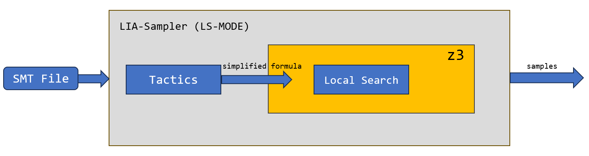
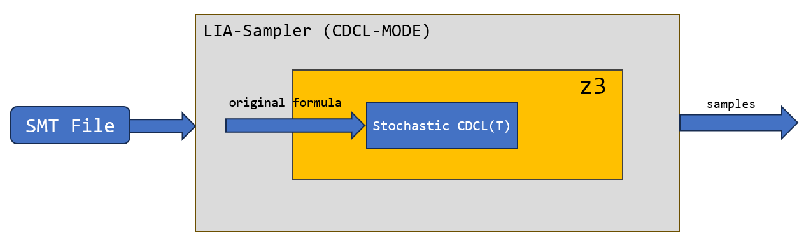
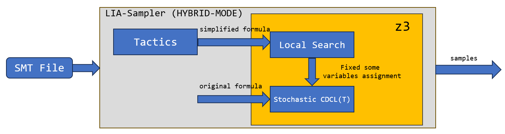

# LIA-Sampler: A Tool for High-Diversity Sampling in Satisfiability Modulo Linear Integer Arithmetic

## 1. Project Structure
In LIA-Sampler, three sampling modes have been implemented, namely *LS-MODE*, *CDCL-MODE*, and *HYBRID-MODE*. The framework for each mode is as follows:

### 1.1. LS-MODE

### 1.2. CDCL-MODE

### 1.3. HYBRID-MODE


Here's an overview of the key components in the project structure:
```bash
.
├── LIA-Sampler
│   ├── LIA_bench
│   ├── make-z3.sh
│   ├── makefile
│   ├── my_scripts
│   ├── src
│   ├── main
│   └── sampler
├── README.md
└── z34Sampling
    ├── CMakeLists.txt
    ├── LICENSE.txt
    ├── README-CMake.md
    ├── README.md
    ├── RELEASE_NOTES
    ├── azure-pipelines.yml
    ├── cmake
    ├── configure
    ├── contrib
    ├── doc
    ├── docker
    ├── examples
    ├── noarch
    ├── resources
    ├── scripts
    ├── src
    │   ├── CMakeLists.txt
    │   ├── ackermannization
    │   ├── api
    │   ├── ast
    │   ├── cadical
    │   ├── cmd_context
    │   ├── math
    │   ├── model
    │   ├── muz
    │   ├── nlsat
    │   ├── opt
    │   ├── params
    │   ├── parsers
    │   ├── qe
    │   ├── sampler
    │   ├── sat
    │   ├── shell
    │   ├── smt
    │   ├── solver
    │   ├── tactic
    │   ├── test
    │   └── util
    ├── z3.pc.cmake.in
    └── z3_info.go
```
The implementation of sampling based on local search is primarily located in the `./z34Sampling/src/sampler` folder.  

In the `./LIA-Sampler/src` folder, we use z3's C++ API to encapsulate the sampling algorithm.  

Note that since this framework relies on certain tactics in z3 (e.g., `solve-eqs`), it requires the use of z3's model generation and model transformation mechanisms.

## 2. Installation
### 2.1. Compile z3

To ensure compatibility and performance, we recommend compiling Z3 within a controlled Python virtual environment:

First, activate the Python virtual environment.

```bash
# Activate the Python virtual environment
cd LIA-Sampler
python3 -m venv venv
source venv/bin/activate

# Compile Z3 with Python bindings
cd z34Sampling
python3 scripts/mk_make.py --python
cd build
make -j 15
make install
```

### 2.2. Compile LIA-Sampler

```bash
cd LIA-Sampler
make
```

## 3. Usage

Run a test case to see how LIA-Sampler works:
```bash
./liasampler -i LIA_bench/LIA_convert_query-1164.smt2 -o samples -n 10 -t 900 -s 123 -m hybrid
```

## 4. Command Line Options
```bash
Usage: ./liasampler [options]
Options:
  -i <smt file>               Specify the path to the input file
  -o <output dir>             Specify the output directory path
  -n <num samples>            Specify the number of samples
  -t <time limit>             Set the time limit (in seconds)
  -s <seed>                   Set the random seed
  -m <sampling mode>          Set the sampling mode <ls, cdcl, hybrid>
  -e <cdcl epoch>             Set CDCL epochs for sampling (Only effective in hybrid mode)
  -p <fixed var percentage>   Set the percentage of fixed variables (Only effective in hybrid mode)
  -h                          Display this help message
```

## 5. Contributors
The following researchers have contributed to this project (sorted alphabetically by last name):
* Yong Lai (laiy@jlu.edu.cn)
* Junjie Li (jjli23@mails.jlu.edu.cn)
* Chuan Luo (chuanluo@buaa.edu.cn)

## 6. Getting Help
For support or questions, please contact the project maintainers at jjli23@mails.jlu.edu.cn or open an issue in our GitHub repository's issue tracker.